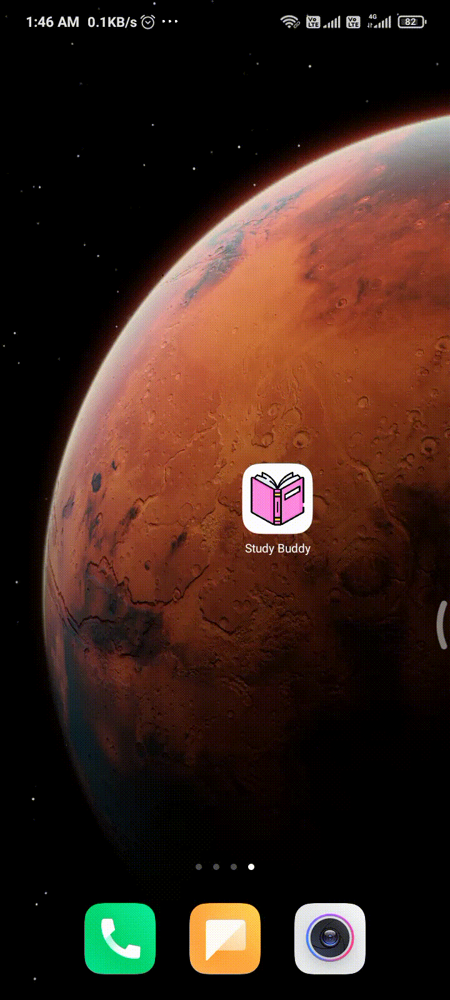

# Study Buddy

This app lets u write and render mathematical formulae with ease. It uses a combination of HTML and Latex to typeset your notes render it beautifully store it synced between devices.

# Demo
<div style='text-align:center'></div>

## Contents

1. [Description](#description)
1. [Project structure](#project-structure)
1. [Project roadmap](#project-roadmap)
1. [License](#license)

## Description
This project aims to provide a flexible crossplatform note taking solution with help of typsetting. 
## Project structure

```
├── .github/            github related files like PR templates, contribution guidelines
├── android             flutter generated android specific code
├── lib                 contains all source codes and modules of projects
  ├──modules          contains low level APIs
├──test                 individual widgets can be tested here
├── .gitignore          stores files and directories to be ignored in commits
├── LICENSE             the open source license
├── pubspec.yaml        metadata of the project
├── pubspec.lock        stores version of every package used in the project
└── readme.md           details and instructions about the project go here

```

## Project roadmap
- Basic editor for writing formula --done
- Sync system --done
- Authentication system --done
- ui improvements
- better editor
- documentations

## Contribution
Experienced a bug or have a suggestion feel free to create an issue.
## License

This project is licensed under the MIT License - see the [LICENSE](LICENSE) file for details.